## 1. Создайте список кортежей, которые содержат данные о 4х человек.

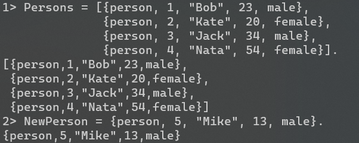

Создаем список кортежей и кортежа

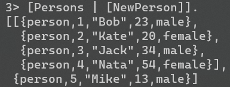

Создаем новый список, где `Persons` является первым элементом (головой), а `[NewPerson] `является остальной частью списка (хвостом). В итоге получаем список списков.

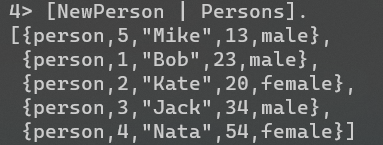

Создаем новый список, добавляя `NewPerson` в начало списка `Persons`. В результате `NewPerson` становится первым элементом нового списка.

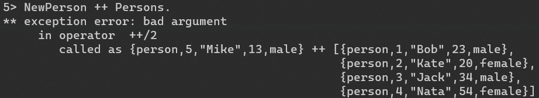

Ошибка, потому что оператор `++` используется для объединения двух списков, а `NewPerson` не является списком.

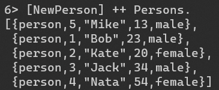

Создаем новый список, добавляя `NewPerson` в начало списка `Persons`. В этом случае `NewPerson` обернут в список, поэтому оператор `++` может объединить два списка вместе

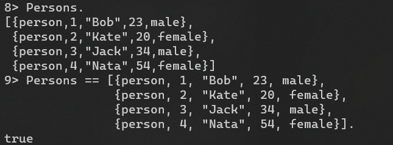

Убеждаемся, что список `Persons` после всех операций неизменился.

## 2. Выполните команды и обратите внимание на результаты полученных команд. Объясните ошибки в некоторых выражениях. 

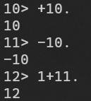

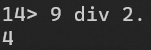

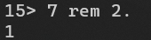

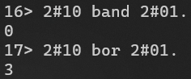

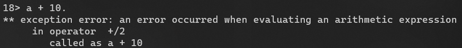

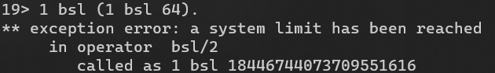

## 3. Напишите слово “Night” как 

