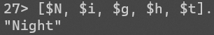

## 1. Создайте список кортежей, которые содержат данные о 4х человек.


Создаем список кортежей и кортежа


Создаем новый список, где `Persons` является первым элементом (головой), а `[NewPerson] `является остальной частью списка (хвостом). В итоге получаем список списков.


Создаем новый список, добавляя `NewPerson` в начало списка `Persons`. В результате `NewPerson` становится первым элементом нового списка (головой).


Ошибка, потому что оператор `++` используется для объединения двух списков, а `NewPerson` не является списком.


Создаем новый список, добавляя `NewPerson` в начало списка `Persons`. В этом случае `NewPerson` обернут в список, поэтому оператор `++` может объединить два списка вместе


Убеждаемся, что список `Persons` после всех операций неизменился.

## 2. Выполните команды и обратите внимание на результаты полученных команд. Объясните ошибки в некоторых выражениях. 

Erlang поддерживает следующие арифметические и логические операции


/ - это деление с плавающей запятой


div  - это целочисленное деление


rem (remainder, остаток) - это взятие остатка по модулю 


Это битовые операция И (AND) и OR, которые применяется к двоичным числам 10 (в десятичной системе это 2) и 01 (в десятичной системе это 1).


Ошибка выводится потому что a - это атом, а с атомами допустимы только операции сранения


Эта строка вызовет ошибку из-за переполнения. Оператор bsl выполняет битовый сдвиг влево. Выражение (1 bsl 64) сдвигает единицу на 64 позиции влево, что приводит к очень большому числу, на которое первая единица также пытается сдвинуться влево.

## 3. Напишите слово “Night” как 


При помо­щи приставки $ получаем ASCII значение символа:




В Erlang строки представляют собой списки целых чисел, где каждое целое число - это код ASCII соответствующего символа. Поэтому все эти записи выводят идентичный результат. 

При этом 

```erlang
[97, 98, 99]. % вернет "abc"
[1, 97, 98, 99]. % вернет [1,97,98,99]
% Erlang будет печатать списки чисел как числа, когда хотя бы одно из них не может представлять букву
```


