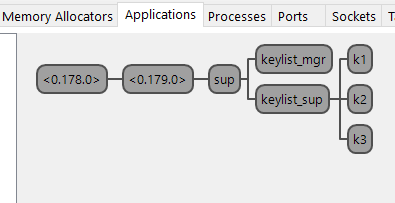

Были созданы два супервизора: [sup](src/sup.erl) и [keylist_sup](src/keylist_sup.erl). Супервизор `sup` наблюдает за двумя процессами: процессом [keylist_mgr](src/keylist_mgr.erl) и супервизором `keylist_sup`. Супервизор `keylist_sup` в свою очередь наблюдает за `keylist`.

Объяснение выбора конфигурации:

- Супервизор `sup`: Этот супервизор использует стратегию `one_for_all`, что означает, что если один из дочерних процессов упадет, все остальные дочерние процессы будут перезапущены. Это нужно, потому что `keylist_sup` и `keylist_mgr` зависят друг от друга. 

- Супервизор `keylist_sup`: Этот супервизор использует стратегию `simple_one_for_one`, что означает, что он может динамически создавать и удалять дочерние процессы во время выполнения. Это полезно, потому что нужно создавать большое количество процессов `keylist`.

- Процессы `keylist_mgr` и `keylist_sup` перезапускаются как `permanent`, потому что они важны и обеспечивают функционал приложения.

- Процесс `keylist` перезапускается как `temporary`, что означает, что он не будет перезапускаться. Данная стратегия была выбрана потому, что `keylist` процессы не являются критически важными для функционирования приложения.


## Тестирование



Рис.1 — Application supervisor tree

Тестирование приложения:

```erlang
2> keylist_mgr:start_child(k1).
keylist_mgr: trying to register process with Name = k1, Pid = <0.232.0>
{ok,<0.232.0>}
3> keylist_mgr:start_child(k2).
keylist_mgr: trying to register process with Name = k2, Pid = <0.323.0>
{ok,<0.323.0>}
4> keylist_mgr:start_child(k3).
keylist_mgr: trying to register process with Name = k3, Pid = <0.327.0>
{ok,<0.327.0>}
5> keylist:add(k1, 1, "one", "comm").
{ok,1}
6> keylist:add(k1, 2, "two", "comm").
{ok,2}
7> keylist:add(k1, 3, "three", "comm").
{ok,3}
8> keylist:is_member(k1, 3).
{ok,true,4}
9> keylist:take(k1, 3).
{ok,{item,3,"three","comm"},5}
10> keylist:find(k1, 3).
{ok,not_found,6}
11> keylist:delete(k1, 2).
{ok,7}
12> keylist:show_list(k1).
{[{item,1,"one","comm"}],8}
13> exit(whereis(k1), some_reason).
keylist_mgr: Monitored process <0.232.0> down with reason: some_reason
=SUPERVISOR REPORT==== 18-Dec-2023::02:57:46.824000 ===
    supervisor: {local,keylist_sup}
    errorContext: child_terminated
    reason: some_reason
    offender: [{pid,<0.232.0>},
               {id,keylist_temp},
               {mfargs,{keylist,start_link,undefined}},
               {restart_type,temporary},
               {significant,false},
               {shutdown,5000},
               {child_type,worker}]

true
```

Из тестирования видно, что все работает как и ожидалось.