## 1 Часть
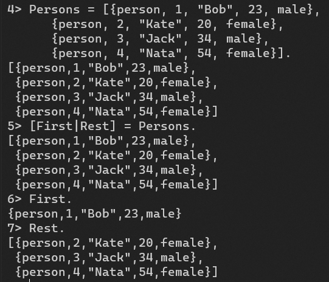
Мы выполняем  операцию pattern matching, для того чтобы разделить список `Persons` на первый элемент и остаток (они же head и tail или голова и хвост). Поэтому переменная `First` будет равна первому элементу списка `Persons`, а переменная `Rest` будет равна новому списку начиная со второго элемента списка `Persons`.

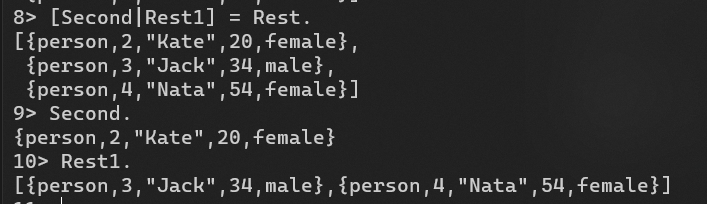

Происходит то же самое, что и в предыдущем случае: переменная `Second` связывается с первым элементом списка `Rest` (или со вторым элементом оригинального списка `Persons`), все остальное связывается со второй переменной `Rest1`.

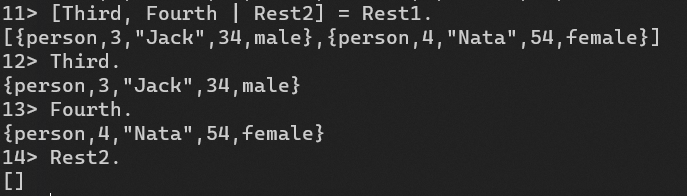

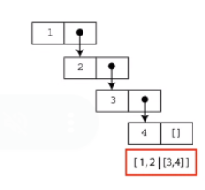

Поскольку в списке `Rest1` находится всего 2 элемента, то после того как они извлекаются, чтобы сопоставится с переменным `Third` и `Fourth`, список `Rest1` становится пустым. И именно этот пустой список и сопоставляется с переменной `Rest2`.

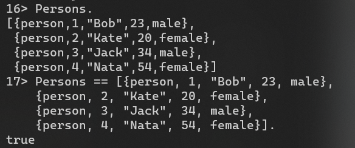

Убеждаемся, что список `Persons` не изменился.

## 2 Часть

Был создан файл заголовка `person.hrl` со следующей записью:

```erlang
-record(person, {id,
                name,
                age,
                gender}).
```

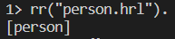

Запись была считана из файла заголовка с помощью команды rr("person.hrl") (rr - read records). 


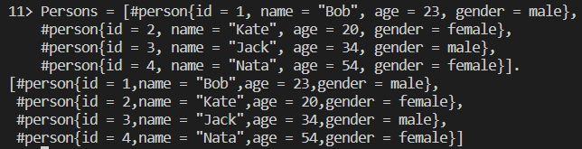

Создание записи, которая сопоставляется с переменной Persons

### 1.

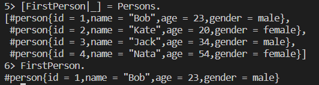

Первый элемент списка Persons (а именно запись `#person{id = 1, name = “Bob”, age = 23, gender = male`), сопоставляется с неинициализированной переменной `FirstPerson`, которая становится равной этому элементу. Прочерк означает анонимную переменную. Таким образом показываем, что мы не заинтересованы в значении этой переменной и ее данные нам не важны.

### 2.

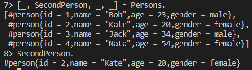

`SecondPerson` сопоставляется со вторым элементом списка Persons. Остальные элементы игнорируются. 

### 3.

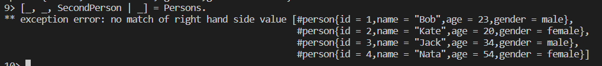

Появляется ошибка, потому что `SecondPerson` (переменная, чьё значение равно `#person{id = 2,name = "Kate",age = 20,gender = female}`) сопоставляется с `#person{id = 3,name = "Jack",age = 34,gender = male}`.

При этом все будет работать, если вместо `SecondPerson` использовать неинициализированную переменную `ThirdPerson` (или равную `#person{id = 3,name = "Jack",age = 34,gender = male}`). 

```erlang
4>[_, _, ThirdPerson | _] = Persons.
[#person{id = 1,name = "Bob",age = 23,gender = male},
 #person{id = 2,name = "Kate",age = 20,gender = female},
 #person{id = 3,name = "Jack",age = 34,gender = male},
 #person{id = 4,name = "Nata",age = 54,gender = female}]
5> ThirdPerson.
#person{id = 3,name = "Jack",age = 34,gender = male}
```

### 4.

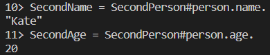

Эти команды извлекают имя и возраст из записи `SecondPerson` и присваивают их переменным `SecondName` и `SecondAge` соответственно.

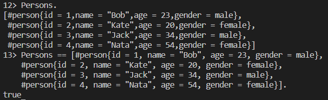

Проверяем и убеждаемся, что список записей Persons не изменился.

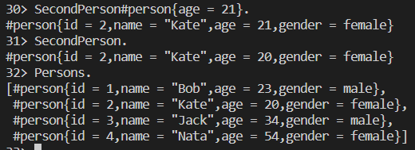

Эта команда создает новую запись на основе записи `SecondPerson`, но с возрастом, установленным в 21 год. Однако это не изменяет исходную запись `SecondPerson` или список `Persons`. В Erlang'e переменные не меняются.

## 3 Часть

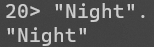

При помо­щи приставки $ получаем ASCII значение символа:

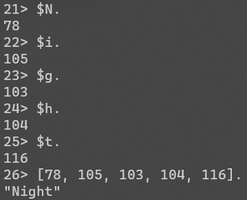

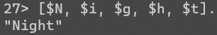

В Erlang строки представляют собой списки целых чисел, где каждое целое число - это код ASCII соответствующего символа. Поэтому все эти записи выводят идентичный результат. 

При этом 

```erlang
[97, 98, 99]. % вернет "abc"
[1, 97, 98, 99]. % вернет [1,97,98,99]
% Erlang будет печатать списки чисел как числа, когда хотя бы одно из них не может представлять букву
```

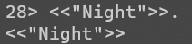

Binary более эффективны в плане потреблен ия памяти.
Их недостатком в сравнении со списками является потеря простоты, когда дело доходит до сопоставления с образцом и манипуляций. Следовательно, предпочтительно использовать binary для хранения текста, который не будет подвергаться обработке слишком часто, или когда сбережение памяти становится настоящей проблемой.