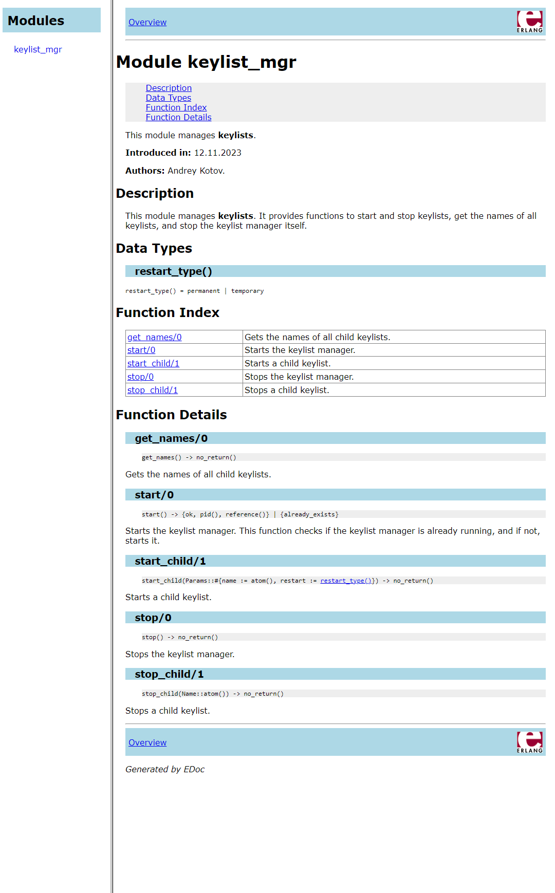

## 1 Часть

Модуль `keylist_mgr` был обновлен, в соответствии с условиями:

```erlang
%%% @author Andrey Kotov
%%% @since 12.11.2023
%%% @doc This module manages <b>keylists</b>.
%%% It provides functions to start and stop keylists, get the names of all keylists, and stop the keylist manager itself.
%%% @end

-module(keylist_mgr).

-export([loop/1, init/1, start/0]).
-export([start_child/1, stop_child/1, get_names/0, stop/0]).

-record(state, {
    children = []   :: list({atom(), pid()}) | [], 
    restart = []    :: list(pid()) | []
}).


%% @doc Initializes the keylist manager.
%% This function sets the process flag to trap exits, registers the process with the given name, and starts the loop.
%% @end
init(Name) ->
    process_flag(trap_exit, true),
    register(Name, self()),
    loop(#state{}).

-spec start() -> {ok, pid(), reference()} | {already_exists}.
%% @doc Starts the keylist manager.
%% This function checks if the keylist manager is already running, and if not, starts it.
%% @end
start() ->
    case whereis(keylist_mgr) of
        undefined -> 
            {Pid, MonitorRef} = spawn_monitor(?MODULE, init, [?MODULE]),
            {ok, Pid, MonitorRef};
        _ ->
            {already_exists}
    end.

-spec start_child(map()) -> no_return().
%% @doc Starts a child keylist.
start_child(Params) ->
    ?MODULE ! {self(), start_child, Params}.

-spec stop_child(atom()) -> no_return().
%% @doc Stops a child keylist.
stop_child(Name) ->
    ?MODULE ! {self(), stop_child, Name}.

-spec get_names() -> no_return().
%% @doc Gets the names of all child keylists.
get_names() ->
    ?MODULE ! {self(), get_names}.

-spec stop() -> no_return().    
%% @doc Stops the keylist manager.
stop() ->
    ?MODULE ! {stop}.

%% @doc The main loop of the keylist manager.
%% This function receives and handles messages to start and stop child keylists, get the names of all child keylists, and stop the keylist manager itself.
%% @end
loop(#state{children = Children, restart = Restarts} = State) ->
    receive
        {From, start_child, #{name := Name, restart := Restart} = _Params } ->
            Res = proplists:lookup(Name, Children),
            case Res of
                none ->
                    {ok, Pid} = keylist:start_link(Name),
                    case Restart of
                        permanent -> 
                            NewState = State#state{children = [{Name, Pid} | Children], restart = [Pid|Restarts]};
                        temporary ->
                            NewState = State#state{children = [{Name, Pid} | Children]}    
                    end,    
                    case From==self() of
                        true -> io:format("Process with name ~p, Pid= ~p started~n", [Name, Pid]);
                        false -> From ! {ok, Pid}
                    end,
                    loop(NewState);
                _ ->
                    From ! {already_exists},
                    loop(State)
            end;
        {From, stop_child, Name} ->
            Res = proplists:lookup(Name, Children),
            case Res of
                none ->
                    From ! {not_found},
                    loop(State);                
                _ ->
                    Name ! {stop, Name},
                    NewState = State#state{children = proplists:delete(Name, Children)},
                    From ! {ok, stop_child},
                    loop(NewState)

            end;
        {From, get_names} ->
            From ! Children,
            loop(State);
        stop ->
            exit(stop_proc);
        {'EXIT', Pid, Reason} -> 

            case lists:keyfind(Pid, 2, Children) of
                false -> 
                    io:format("Received an exit signal from an unknown process with pid = ~p and reason = ~p~n", [Pid, Reason]),
                    loop(State);
                {Name, Pid} ->
                    case lists:member(Pid, Restarts) of
                        true ->
                            NewState = State#state{children = proplists:delete(Name, Children)},
                            start_child(#{name => Name, restart => permanent});
                        false ->
                            NewState = State#state{children = proplists:delete(Name, Children)}
                    end,    
                    io:format("Process with name = ~p, pid = ~p exited with reason ~p~n", [Name, Pid, Reason]),
                    loop(NewState)
            end            
    end.
```
Модуль был проанализирован `dialyzer`'ом на наличие ошибок, и, как видно, ошибок не было обнаружено.
```shell
src>  dialyzer .\keylist_mgr.erl
  Checking whether the PLT c:/Users/Admin/AppData/Local/erlang/Cache/.dialyzer_plt is up-to-date... yes
  Proceeding with analysis... done in 0m0.21s
done (passed successfully)
```

Были добавлены spec и документация в модуль `keylist_mgr`. Были добавлены API-функции для сообщений. Также была изменена функция `keylist_mgr:start_child/1`, которая теперь принимает `Params` (`Params :: #{name => atom(), restart => permanent | temporary}`) вместо `Names`. Был добавлен функционал для перезапуска `permanent` процессов.

```erlang
1> keylist_mgr:start().
{ok,<0.87.0>,#Ref<0.3217181286.3547856897.76438>}
2> keylist_mgr:start_child(#{name => keylist1, restart => temporary}).
{<0.85.0>,start_child,
 #{name => keylist1,restart => temporary}}
3> keylist_mgr:start_child(#{name => keylist2, restart => permanent}).
{<0.85.0>,start_child,
 #{name => keylist2,restart => permanent}}
4> keylist_mgr:start_child(#{name => keylist3, restart => permanent}).
{<0.85.0>,start_child,
 #{name => keylist3,restart => permanent}}
5> exit(whereis(keylist1), "Some reason").
Process with name = keylist1, pid = <0.89.0> exited with reason "Some reason"
true
6> exit(whereis(keylist2), "Some reason").
Process with name = keylist2, pid = <0.91.0> exited with reason "Some reason"
true
Process with name keylist2, Pid= <0.96.0> started
7> exit(whereis(keylist3), "Some reason").
Process with name = keylist3, pid = <0.93.0> exited with reason "Some reason"
true
Process with name keylist3, Pid= <0.98.0> started
8> whereis(keylist1).
undefined
9> whereis(keylist2).
<0.96.0>
10> whereis(keylist3).
<0.98.0>
11> flush().
Shell got {ok,<0.89.0>}
Shell got {ok,<0.91.0>}
Shell got {ok,<0.93.0>}
ok
12> keylist_mgr:get_names().
{<0.85.0>,get_names}
13> flush().
Shell got [{keylist3,<0.98.0>},{keylist2,<0.96.0>}]
ok
```

Видно, что все работает корректно и `permanent` процессы запускаются снова, `temporary` же завершаются и не перезапускаются `keylist_mgr`'ом. Список также корректно обновлен (был удален `temporary` процесс и обновлены `permanent` процессы).

С помощью команды `edoc:files(["keylist_mgr.erl"]).` была сгенерирована документация для модуля `keylist_mgr.erl`.

Она выглядит следующим образом:


# 2 Часть

В соответсвии с заданием, был обновлен модуль `keylist`:

```erlang
%%% @author Andrey Kotov
%%% @since 12.11.2023
%%% @doc This module manages keylists.
-module(keylist).

-export([loop/1, start_monitor/1, start_link/1]).
-export([init/1]).
-export([add/4, is_member/2, take/2, find/2, delete/2, show_list/1, stop/1]).

-record(state, {
    list = []   :: list(#state{}) | [], 
    counter = 0 :: integer()
}).


-spec add(atom(), any(), any(), any()) -> no_return().
%% @doc Adds a key-value pair to the keylist.
add(Name, Key, Value, Comment) ->
    Name ! {self(), add, Key, Value, Comment}.

-spec is_member(atom(), any()) -> no_return().  
%% @doc Checks if a key is a member of the keylist.  
is_member(Name, Key) ->
    Name ! {self(), is_member, Key}. 

-spec take(atom(), any()) -> no_return(). 
%% @doc Takes a key-value pair from the keylist.
take(Name, Key) ->
    Name ! {self(), take, Key}. 

-spec find(atom(), any()) -> no_return().
%% @doc Finds a key-value pair in the keylist. 
find(Name, Key) ->
    Name ! {self(), find, Key}. 

-spec delete(atom(), any()) -> no_return(). 
%% @doc Deletes a key-value pair from the keylist.
delete(Name, Key) ->
    Name ! {self(), delete, Key}. 

-spec show_list(atom()) -> no_return(). 
%% @doc Shows the list of key-value pairs in the keylist.
show_list(Name) ->
    Name ! {self(), show_list}. 

-spec stop(atom()) -> no_return(). 
%% @doc Stops the keylist.
stop(Name) ->
    Name ! {stop, Name}. 

%% @doc The main loop of the keylist.
%% This function receives and handles messages to add, check, take, find, and delete key-value pairs, show the list of all key-value pairs, and stop the keylist.
%% @end
loop(#state{list = List, counter = Counter} = State) ->
    receive
        {From, add, Key, Value, Comment} ->
            NewState = State#state{list = [{Key, Value, Comment} | List], counter = Counter + 1},
            From ! {ok, NewState#state.counter},
            loop(NewState);
        {From, is_member, Key} ->
            Res = lists:keymember(Key, 1, List),
            NewState = State#state{counter = Counter + 1},
            From ! {ok, Res, NewState#state.counter},
            loop(NewState);
        {From, take, Key} ->
            Res = lists:keytake(Key, 1, List),
            case Res of
                false ->
                    NewState = State#state{counter = Counter + 1},
                    From ! {ok, not_found, NewState#state.counter},
                    loop(NewState);
                _ ->
                    {_, Found, NewList} = Res,
                    NewState = State#state{list = NewList, counter = Counter + 1},
                    From ! {ok, Found, NewState#state.counter},
                    loop(NewState)
            end;
        {From, find, Key} ->
            Res = lists:keyfind(Key, 1, List),
            NewState = State#state{counter = Counter + 1},
            case Res of
                false ->
                    From ! {ok, not_found, NewState#state.counter},
                    loop(NewState);
                _ ->
                    From ! {ok, Res, NewState#state.counter},
                    loop(NewState)
            end;
        {From, delete, Key} ->
            Res = lists:keydelete(Key, 1, List),
            NewState = State#state{counter = Counter + 1, list = Res},
            From ! {ok, Res, NewState#state.counter},
            loop(NewState);
        {From, show_list} ->
            NewState = State#state{counter = Counter + 1},
            From ! {ok, List, NewState#state.counter},
            loop(NewState);
        {stop, Name} ->
            exit(stop_proc),
            {ok, Name, stopped}
    end.

-spec start_monitor(atom()) -> {ok, pid(), reference()}.
%% @doc Starts a monitor for the keylist.
start_monitor(Name) ->
    {Pid, MonitorRef} = spawn_monitor(?MODULE, init, [Name]),
    {ok, Pid, MonitorRef}.

-spec start_link(atom()) -> {ok, pid()}.
%% @doc Starts a link for the keylist.
start_link(Name) ->
    Pid = spawn_link(?MODULE, init, [Name]),
    {ok, Pid}.

%% @doc Initializes the keylist.
%% This function registers the process with the given name and starts the loop.
init(Name) ->
    register(Name, self()),
    loop(#state{}).
```

Модуль был проанализирован `dialyzer`'ом на наличие ошибок, и, как видно, ошибок не было обнаружено.
```shell
src>  dialyzer .\keylist.erl
  Checking whether the PLT c:/Users/Admin/AppData/Local/erlang/Cache/.dialyzer_plt is up-to-date... yes
  Proceeding with analysis... done in 0m0.34s
done (passed successfully)
```

Были добавлены spec и документация в модуль `keylist`. Были добавлены API-функции для сообщений.

```erlang
14> keylist:add(keylist3, 1, "banana", "fruit").
{<0.85.0>,add,1,"banana","fruit"}
15> keylist:add(keylist3, 2, "apple", "fruit").
{<0.85.0>,add,2,"apple","fruit"}
16> keylist:is_member(keylist3, 2).
{<0.85.0>,is_member,2}
17> flush().
Shell got {ok,1}
Shell got {ok,2}
Shell got {ok,true,3}
ok
```

Как видно, теперь работают API-функции.