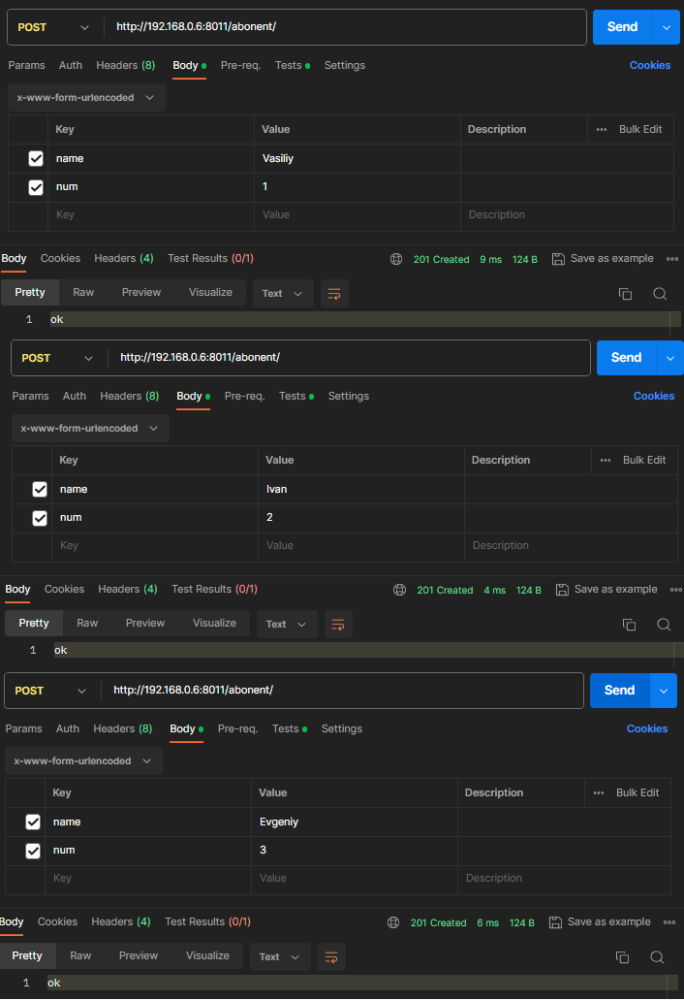
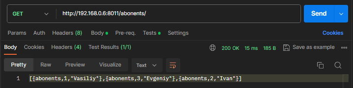
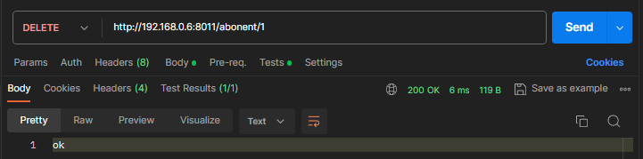
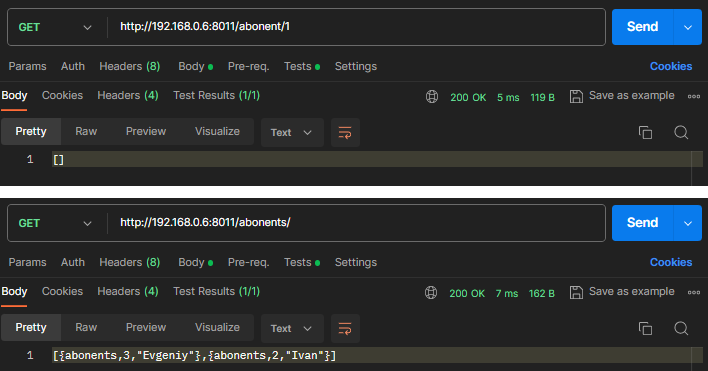

Был реализован модуль [user_db.erl](apps/hw18/src/user_db.erl) для обработки запросов по работе с `mnesia`.

Так же был реализован Web api для обработки пользовательских запросов, с помощью модулей [abonent_handler.erl](apps/hw18/src/abonent_handler.erl) (который отвечает за обработку POST, GET, DELETE запросов для соответственно добавления, демонстрации и удаления пользователя) и [abonents_handlers.erl](apps/hw18/src/abonents_handler.erl) (отвечает за вывод всех пользователей).

## Тестирование

Рис. 1 — Вставка данных в таблицу

Рис. 2 — Проверка таблицы

Рис. 3 — Удаление данных из таблицы

Рис. 4 — Проверка данных таблицы

Как видно из результатов тестирования, все работает корректно.